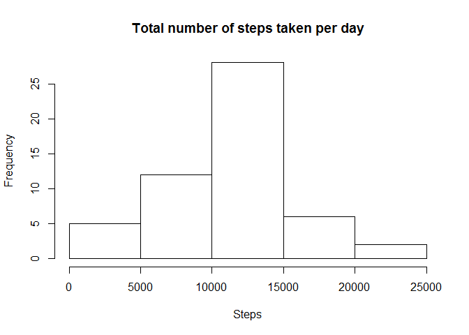
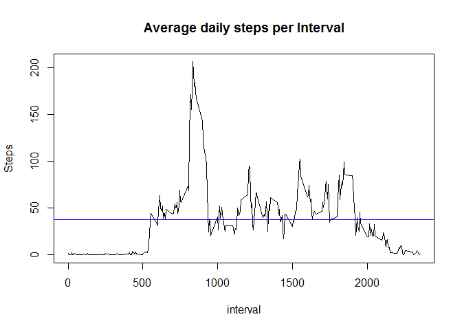
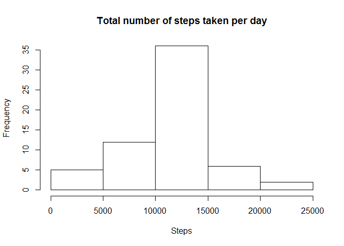
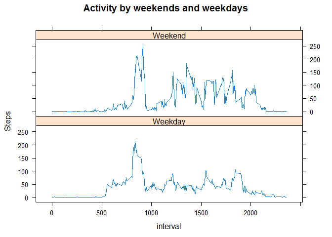

# Reproducible Research: Peer Assessment 1


### Loading and preprocessing the data

Download the dataset for this assignment from this link: [Activity Monitoring data](https://d396qusza40orc.cloudfront.net/repdata%2Fdata%2Factivity.zip)  

1. Load the data


```r
#Set your working directory to the location of the downloaded zip file.
setwd("C:/RepData_PeerAssessment1")

#Unzip the file
unzip("activity.zip", exdir="./data")

#Load the data
data <- read.csv("./data/activity.csv")

#see the structure of the dataset
str(data)
```

```
## 'data.frame':	17568 obs. of  3 variables:
##  $ steps   : int  NA NA NA NA NA NA NA NA NA NA ...
##  $ date    : Factor w/ 61 levels "2012-10-01","2012-10-02",..: 1 1 1 1 1 1 1 1 1 1 ...
##  $ interval: int  0 5 10 15 20 25 30 35 40 45 ...
```

2. Process/transform the data (if necessary) into a format suitable for your analysis


```r
#change date variable to date type
dates <- data$date
data$date <-  as.Date(as.character(data$date),"%Y-%m-%d")
```


***


### What is mean total number of steps taken per day?

1. Calculate the total number of steps taken per day

```r
library(dplyr)

#Summarise the data to get total number of steps taken per day
totalsteps <- data %>%
        select(steps,date) %>%
        group_by(date) %>%
        summarise(total = sum(steps))
```
2. Make a histogram of the total number of steps taken each day


```r
hist(totalsteps$total, main = "Total number of steps taken per day", xlab = "Steps")
```

<!-- -->

3. Calculate and report the mean and median of the total number of steps taken per day  

```r
mean <- mean(totalsteps$total, na.rm = TRUE)
mean
```

```
## [1] 10766.19
```


```r
median <- median(totalsteps$total, na.rm = TRUE)
median
```

```
## [1] 10765
```


***


### What is the average daily activity pattern?
1. Make a time series plot (i.e. type = "l") of the 5-minute interval (x-axis) and the average number of steps taken, averaged across all days (y-axis) 

```r
#Summarise data to get the average number of steps taken across all days
avgbyinterval <- data %>%
                group_by(interval) %>%
                summarise(avgsteps = mean(steps, na.rm=TRUE))

#Create the plot
with(avgbyinterval,plot(interval, avgsteps, type="l", main= "Average daily steps per Interval", ylab= "Steps"))

#Create a line indicating the mean
abline(h= mean(avgbyinterval$avgsteps, na.rm = TRUE),col="blue")
```

<!-- -->

2. Which 5-minute interval, on average across all the days in the dataset, contains the maximum number of steps?

```r
avgbyinterval[which.max(avgbyinterval$avgsteps),]
```

```
## # A tibble: 1 x 2
##   interval avgsteps
##      <int>    <dbl>
## 1      835 206.1698
```


***


### Imputing missing values

1. Calculate and report the total number of missing values in the dataset (i.e. the total number of rows with NAs)

```r
sum(is.na(data)) 
```

```
## [1] 2304
```

2. Devise a strategy for filling in all of the missing values in the dataset. The strategy does not need to be sophisticated. For example, you could use the mean/median for that day, or the mean for that 5-minute interval, etc. and (3.)create a new dataset that is equal to the original dataset but with the missing data filled in.

```r
#Filled missing values with the mean for that 5-minute interval
datacompleted <- data
datacompleted$steps <- with(datacompleted, ave(steps,interval,
                          FUN = function(x) replace(x, is.na(x), mean(x, na.rm = TRUE))))
```

4. Make a histogram of the total number of steps taken each day and Calculate and report the mean and median total number of steps taken per day. 


```r
#Summarise the data to get total number of steps taken per day
totalsteps2 <- datacompleted %>%
        select(steps,date) %>%
        group_by(date) %>%
        summarise(total = sum(steps))

#Create a histogram
hist(totalsteps2$total, main = "Total number of steps taken per day", xlab = "Steps")
```

<!-- -->

```r
#Get the mean
mean2 <- mean(totalsteps2$total, na.rm = TRUE)
mean2
```

```
## [1] 10766.19
```

```r
#Get the median
median2 <- median(totalsteps2$total, na.rm = TRUE)
median2
```

```
## [1] 10766.19
```

4.1 Do these values differ from the estimates from the first part of the assignment? 

```r
#Create a data frame to show the difference between the mean and the median with missing values and missing values filled in.
comparison <- data.frame(Filled.In =c(mean,median2), 
                         With.Missing = c(mean,median), 
                         Difference = c(mean2-mean,median2-median),
                         row.names = c("Mean","Median"))
comparison
```

```
##        Filled.In With.Missing Difference
## Mean    10766.19     10766.19   0.000000
## Median  10766.19     10765.00   1.188679
```


4.2 What is the impact of imputing missing data on the estimates of the total daily number of steps?

The mean stays the same but the median has a difference of 1.188679, using the mean for the 5-minute inverval on the missing values.


***


### Are there differences in activity patterns between weekdays and weekends?

1.Create a new factor variable in the dataset with two levels - "weekday" and "weekend" indicating whether a given date is a weekday or weekend day.

```r
#Createe a new variable for Weekend and Weekday and summarise to get the average number of steps take across all days.
addingweekday <- datacompleted %>%
                select(steps,date, interval) %>%
                mutate(weekday = ifelse(weekdays(date)=="Saturday" |weekdays(date)=="Saturday",
                                        "Weekend","Weekday" )) %>%
                group_by(interval,weekday) %>%
                summarize(avg=mean(steps,na.rm=TRUE))%>%
                ungroup()
```


2. Make a panel plot containing a time series plot (i.e. type = "l") of the 5-minute interval (x-axis) and the average number of steps taken, averaged across all weekday days or weekend days (y-axis). 


```r
library(lattice)

#Create plot to show the average number of steps taken by weekdays and by weekends
xyplot(avg ~ interval | weekday, data = addingweekday, type= "l",main= "Activity by weekends and weekdays",
       ylab= "Steps",layout = c(1, 2))
```

<!-- -->

There is more activity during the weekends than the weekdays.

